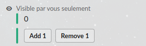

# Aido

_Slack applications made simple !_

Aido is a javascript framework to write Slack applications in a clean and simple way. Its intent is to take away the specificities of the Slack API, and make Slack applications code more like regular old web applications.

You can think of Aido as being a basic Single Page App framework, where your app renders as Slack messages instead of a page in a browser :

- Design your views using a [subset of HTML](https://github.com/aidojs/html2slack)
- Write your controllers as javascript classes
- Aido handles all user interactions (button clicks, slash command invocations) for you, and updates the view accordingly

## A basic example

_Complete documentation can be found in the [Aido wiki](https://github.com/aidojs/aido/wiki)_

Let's create a very simple Slack application :

- It handles 1 slash command, `/number`
- When the user calls it, it will display a view with a Number (initialized at 0) and two buttons
- When the user clicks one of the buttons, it will increment / decrement the Number and refresh the view

It will render on Slack as such :



First we describe our view using the Pug templating language
```pug
# views/number.pug
body
  section
    p #{state.number}
  section
    button(name="increment") Add 1
    button(name="decrement") Remove 1
```

Then we create our Javascript program :
```javascript
// index.js
const { Slash } = require('aido')

// This is our controller. In Aido it is called a Slash because it represents one slash command on the Slack workspace
class Number extends Slash {
  /**
   * Initializes the internal state of the application
   */
  initState() {
    return {
      number: 0
    }
  }

  /**
   * Increments the number. This method will be called by clicking the first button.
   * (because it has the same `name` as the button)
   */
  increment() {
    this.state.number += 1
  }

  /**
   * Decrements the number. This method will be called by clicking the second button.
   * (because it has the same `name` as the button)
   */
  decrement() {
    this.state.number -= 1
  }

  /**
   * Bonus feature : if the user types a number next to the command (`/number 6`)
   * then it will be used as a start value instead of 0
   */
  handleText() {
    const int = parseInt(this.args(0), 10) // arguments are passed as strings so they need to be parsed
    if (int) {
      this.state.number = int
    }
  }
}

// Initialize aido
aido.init({
  slash: { number: Number },
})

// Start the aido server (on port 3000 by default)
aido.start()
```

## Digging deeper

Like what you see ?

⌨️ Jump right in the code by taking a look at the [examples folder](/examples) 

📚 Or read the documentation in the [Aido wiki](https://github.com/aidojs/aido/wiki) 
